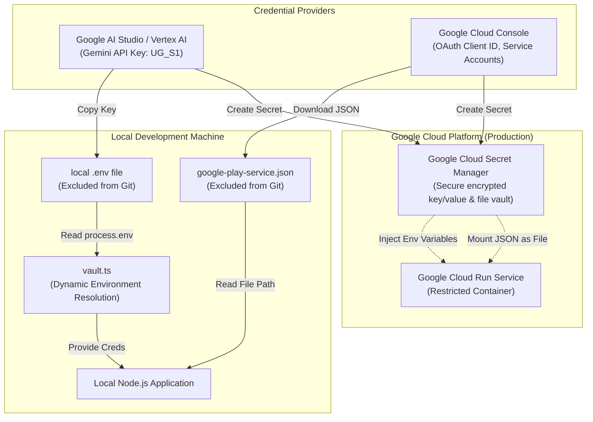

# DJ MIDI Watts - Developer Secrets & Cloud Run Security Architecture

This directory serves as the restricted configuration layer for managing sensitive keys, API credentials, and service accounts. This guide describes how local development secrets, Google AI Studio, Google Cloud Console, and Google Cloud Run communicate securely while protecting the production and development environments.

---

## 🔒 Security Architecture Flow

The diagram below illustrates how API keys and credentials flow from providers (like Google AI Studio) to both local development environments and the deployed Cloud Run service.



---

## ⚠️ The Golden Rule: Do Not Deploy Secrets Files

> [!WARNING]
> **CRITICAL SECURITY RISK:**
> When deploying the application to Google Cloud Run, **do not package local secrets files** (such as `google-play-service.json` or the root `.env` file) into the final container image or upload them directly.
>
> Baking raw secret values into a container permanently stores them in the image registry, exposing them to unauthorized access. Local configuration must reside strictly on the developer machine, while production configuration is managed exclusively via Google Cloud Secret Manager.

---

## 🌉 Bridging the Gap: Secret Manager & Cloud Run

Since Cloud Run runs in a secure, serverless cloud environment that cannot access your local drive, the configuration gap is bridged by mapping local environment keys to Secret Manager resources:

### 1. Local Secrets Vault (`vault.ts`)

The [vault.ts](./vault.ts) file acts as a typed programmatic interface. It does not store raw secrets; instead, it dynamically maps config fields to system environment variables (`process.env`). This allows the exact same code to resolve local credentials on a developer machine and production credentials in the cloud:

- **Gemini AI Orchestration Key (`UG_S1`)**: Sourced from Google AI Studio / Google Cloud Console.
- **Google OAuth Web Client ID (`UG_S2`)**: Sourced from Google Cloud Console Credentials.
- **Keystore Passwords (`UG_S3_KEYSTORE_PASS`)**: Used to secure internal certificates.

### 2. Google Cloud Secret Manager (Cloud Console)

For production deployments, each variable from the local environment is duplicated as a Secret in the Google Cloud Console:

| Local Variable / File | Secret Manager Secret Name | Recommended Cloud Run Exposure Type | Description / Destination in Cloud |
| :--- | :--- | :--- | :--- |
| `UG_S1` | `UG_S1` | Environment Variable | Gemini AI Orchestration Key (AI Studio) |
| `UG_S2` | `UG_S2` | Environment Variable | Google OAuth Web Client ID |
| `UG_S3_KEYSTORE_PASS` | `UG_S3_KEYSTORE_PASS` | Environment Variable | Password for client mTLS keystore |
| `PLAY_API_KEY` | `PLAY_API_KEY` | Environment Variable | Google Play Console API Key |
| `google-play-service.json` | `GOOGLE_PLAY_SERVICE_JSON` | **Volume Mount / File** | Complete Firebase/Google Play Service Account JSON content |

### 3. Injecting Secrets into Cloud Run

During Cloud Run service setup, link Secret Manager entries to the service instance:

- **Environment Variable Mapping**: Directly bind secrets like `UG_S1` and `UG_S2` to environment variables of the same name.
- **File / Volume Mounting**: For multi-line JSON secrets like `google-play-service.json`, mount the secret as a file (e.g., `/secrets/google-play-service.json`) in the container filesystem, and point the application config to that path:

  ```env
  GOOGLE_APPLICATION_CREDENTIALS="/secrets/google-play-service.json"
  ```

---

## 🔄 Perfect Synchronization Checklist

To ensure secure, synchronized communication across all developer machines and cloud instances:

- [x] **Git Isolation**: Verify that `.env` and `secrets/google-play-service.json` are added to the root [.gitignore](../.gitignore) file.
- [x] **No Hardcoding**: Never write plaintext keys inside [vault.ts](./vault.ts) or any other codebase file.
- [x] **Synchronized Naming**: Ensure environment variables in Cloud Run configuration match the local keys exactly.
- [x] **Relative References**: All references to secret files within documentation or configuration templates must use relative repository paths (e.g., `./google-play-service.json`) rather than absolute local machine paths (e.g., `C:\Users\...`).
